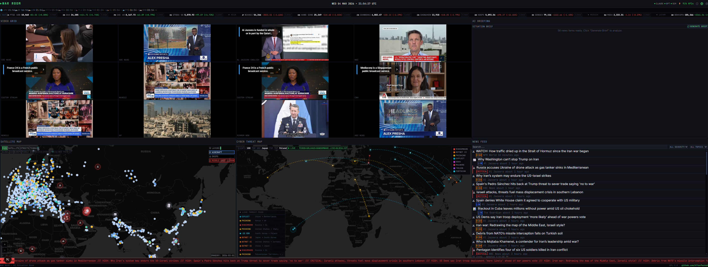
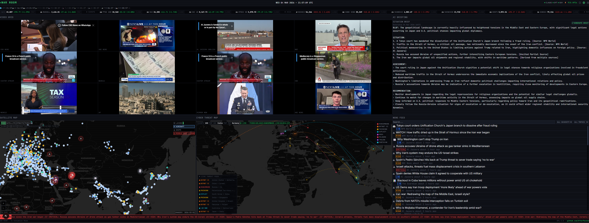
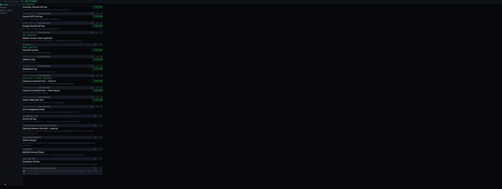

# War Room

**Open-source geopolitical intelligence dashboard** — live news feeds, multi-stream video, interactive satellite map, AI situation briefs, market data, and cyber threat tracking in a single browser interface.

Built for analysts, journalists, researchers, and anyone who needs a real-time operational picture across multiple data sources.

---

## Screenshots







---

## Features

### Live Video Grid
- Watch up to 16 simultaneous streams in a resizable grid
- Supports YouTube live, Twitch, and any `.m3u8` HLS stream
- Drag-and-drop to swap tile positions
- Picture-in-Picture (PiP) support
- Pre-loaded with major US, international, and financial news channels
- Stream-ended detection with one-click retry

### Interactive Map
- MapLibre GL (free, no API key required)
- Multiple base layers: Dark Matter, Satellite, Street, Topographic
- **Live aircraft tracking** via OpenSky Network (free, optional auth for higher limits)
- **Live ship tracking** via AISHub / MyShipTracking (simulated fallback included)
- **News pin overlay** — geocoded headlines plotted as map markers
- **Conflict events** via ACLED plotted on the map
- **Satellite imagery** layers (NASA GIBS MODIS, Sentinel Hub Copernicus — optional key)
- **Fire data** via NASA FIRMS
- **Cyber threat arcs** — animated attack visualisation in a dedicated popout window
- Conflict zone presets for rapid navigation

### News Intelligence
- Aggregates from NewsAPI, GNews, and GDELT (free fallback, no key needed)
- AI-assisted categorisation: conflict, politics, economy, security, disaster, tech, health
- Severity scoring: critical / high / medium / low
- Live deduplication — new articles prepended without a full page refresh
- Filter by category, severity, source, or keyword

### AI Situation Briefs
- Supports **Anthropic Claude**, **OpenAI GPT**, and **Google Gemini**
- Auto-generate executive-style intelligence summaries from live news
- Persistent chat interface — ask follow-up questions with full news context
- Live headlines injected automatically as AI context

### Markets Ticker
- Scrolling live ticker between the header and dashboard
- 16 global indices across US, Europe, Asia, and emerging markets
- Per-market OPEN / PRE / POST / CLOSED status badges
- Yahoo Finance data — no API key required, refreshes every 60 seconds

### Cyber Threat Map
- Live IOC feed from ThreatFox (abuse.ch)
- Animated attack arcs between source and target countries
- Threat type breakdown: ransomware, botnet C2, phishing, exploits, DDoS
- Live feed panel with timestamp and attribution
- Opens as a popout window for multi-monitor use

### Multi-Monitor Support
- Pop any panel (video grid, map, news, AI, cyber map) out to a separate window
- Windows sync state in real time via the browser BroadcastChannel API
- Designed for dual or triple monitor setups

### Security
- All API keys encrypted with **AES-256-GCM** before storage
- Keys stored in a local SQLite database — never exposed to the browser
- All external API calls are server-proxied (keys never reach the client)
- Strict Content Security Policy headers on every response
- SSRF protection on all server-side fetch routes
- Rate limiting on AI endpoints

---

## Stack

| Layer | Technology |
|-------|-----------|
| Framework | Next.js 15 (App Router) |
| UI | React 19, Tailwind CSS 4 |
| State | Zustand v5 (persist middleware) |
| Map | MapLibre GL v4 |
| Key storage | better-sqlite3 (local SQLite) |
| Encryption | Node.js `crypto` — AES-256-GCM |

---

## Getting Started

### Prerequisites
- Node.js 18+
- npm (or yarn / pnpm)

### 1. Clone & Install

```bash
git clone https://github.com/YOUR_USERNAME/war-room.git
cd war-room
npm install
```

### 2. Configure Environment

```bash
cp .env.local.example .env.local
```

Open `.env.local` and set `ENCRYPTION_SECRET` to a random 64-character hex string:

```bash
node -e "console.log(require('crypto').randomBytes(32).toString('hex'))"
```

### 3. Run

```bash
npm run dev
```

Open [http://localhost:3000](http://localhost:3000).

The app works immediately with **no API keys** — the map, markets ticker, and simulated tracking data are all available out of the box.

---

## API Keys (all optional)

Navigate to **Settings** (⚙ gear icon, top-right) → **API Keys** tab. Keys are encrypted and stored locally — never committed to version control.

| Service | Purpose | Free Tier |
|---------|---------|-----------|
| [NewsAPI.org](https://newsapi.org) | News aggregation | 100 req/day |
| [GNews.io](https://gnews.io) | News aggregation | 100 req/day |
| [Anthropic Claude](https://console.anthropic.com) | AI situation briefs | Pay-per-use |
| [OpenAI](https://platform.openai.com) | AI situation briefs (GPT-4o) | Pay-per-use |
| [Google Gemini](https://aistudio.google.com) | AI situation briefs | Free tier available |
| [OpenSky Network](https://opensky-network.org) | Live aircraft tracking | Free (anon or registered) |
| [AISHub](https://www.aishub.net) | Live ship tracking | Free with registration |
| [MyShipTracking](https://www.myshiptracking.com) | Live ship tracking | Paid |
| [NASA FIRMS](https://firms.modaps.eosdis.nasa.gov/api) | Fire / thermal anomaly data | Free with registration |
| [ACLED](https://acleddata.com) | Conflict events | Free for researchers |
| [Sentinel Hub (Copernicus)](https://dataspace.copernicus.eu) | Satellite imagery | Free with registration |

---

## Project Structure

```
war-room/
├── app/
│   ├── page.tsx              # Main dashboard
│   ├── layout.tsx            # Root layout, fonts, global CSS
│   ├── settings/             # Settings page
│   ├── popout/               # Multi-screen panel windows
│   └── api/                  # Server-side API proxy routes
│       ├── ai/               # Claude / GPT / Gemini proxy
│       ├── cyber/            # ThreatFox IOC feed + geo enrichment
│       ├── markets/          # Yahoo Finance quotes
│       ├── news/             # NewsAPI / GNews / GDELT aggregation
│       ├── satellite/        # Aircraft, ships, ACLED, FIRMS, Sentinel
│       ├── settings/         # Encrypted key storage (read/write)
│       ├── streams/          # YouTube / HLS stream helpers
│       └── tiles/            # Map tile proxy
│
├── components/
│   ├── layout/               # Header, DashboardGrid, PanelWrapper
│   ├── video/                # VideoGrid, VideoTile, HLSPlayer, ChannelSidebar
│   ├── map/                  # MapPanel, MapControls, layers (news, aircraft, ships)
│   ├── news/                 # NewsFeed, NewsFilters
│   ├── ai/                   # SituationBrief, AIChat
│   ├── cyber/                # CyberMap (canvas arc animation)
│   ├── markets/              # MarketTicker
│   └── settings/             # SettingsModal, APIKeysTab, WorldClocksTab
│
├── lib/
│   ├── security/             # Encryption, SSRF guard, sanitization, rate limiting
│   ├── store/                # Zustand stores (settings, streams, map, news)
│   ├── ai/                   # AI provider prompt templates
│   ├── multiscreen/          # BroadcastChannel sync, popout helpers
│   ├── utils/                # geo.ts, constants.ts (map styles, channel defaults)
│   └── db.ts                 # SQLite key storage wrapper
│
├── styles/
│   └── globals.css           # Global styles, map popup CSS, ticker animation
│
├── proxy.ts                  # Next.js middleware (CSP, CORS, security headers)
├── .env.local.example        # Environment variable template — copy to .env.local
└── .warroom-data/            # Local SQLite DB — gitignored, created on first run
```

---

## Environment Variables

| Variable | Required | Description |
|----------|----------|-------------|
| `ENCRYPTION_SECRET` | **Yes** | 64-char hex string — encrypts the API key database |
| `NEXT_PUBLIC_APP_URL` | No | App URL for CORS checks (default: `http://localhost:3000`) |

---

## Keyboard Shortcuts

| Key | Action |
|-----|--------|
| `S` | Open Settings |
| `G` | Toggle world clock strip |
| `R` | Refresh news feed |
| `Esc` | Close open sidebar or modal |

---

## Multi-Monitor Setup

1. Open the dashboard in your primary browser window
2. Click the **⧉** icon on any panel to pop it out
3. Drag the new window to a secondary monitor
4. All panels stay in sync automatically via BroadcastChannel — no server needed

---

## Deployment

### Vercel (recommended)

1. Push to GitHub
2. Import the repo into [Vercel](https://vercel.com)
3. Add environment variables in **Project → Settings → Environment Variables**:
   - `ENCRYPTION_SECRET` — generate a new 64-char hex value for production
   - `NEXT_PUBLIC_APP_URL` — your production domain (e.g. `https://warroom.example.com`)
4. Deploy

> **Note:** The SQLite database is local to the server process. On serverless/edge deployments API keys must be re-entered after cold starts, or you can replace `lib/db.ts` with a persistent KV store (e.g. Upstash Redis, Vercel KV).

### Self-hosted (Node.js)

```bash
npm run build
NODE_ENV=production npm start
```

Keep the `.warroom-data/` directory on a persistent volume so the encrypted key database survives restarts.

---

## Contributing

Pull requests are welcome. For major changes please open an issue first to discuss what you would like to change.

---

## License

[GPL-3.0](LICENSE)
